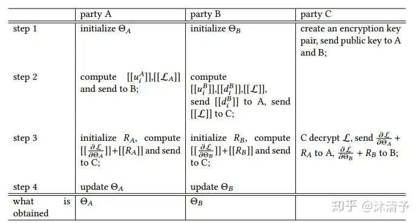

[toc]

# Federated Learning入门

## 横向

特征相同但是数据集不同

目标相同, 但是持有不一样的数据, (不同的银行, 持有不也一样的用户群体, 同样的目标)

## 纵向

适用于两个数据集共享相同的样本 ID 空间但在特征空间不同的情况

考虑同一城市的两家不同公司，一家是银行，另一家是电子商务公司。他们的用户集可能包含该地区的大部分居民，所以他们的用户空间的交集很大。然而，由于银行记录了用户的收支行为和信用等级，而电子商务保留了用户的浏览和购买历史，他们的特征空间是非常不同的。假设希望双方都能有一个基于用户和产品信息的产品购买预测模型。

$\min _{\Theta_A, \Theta_B} \sum_i\left\|\Theta_A x_i^A+\Theta_B x_i^B-y_i\right\|^2+\frac{\lambda}{2}\left(\left\|\Theta_A\right\|^2+\left\|\Theta_B\right\|^2\right)$

令: $u_i^A=\Theta_A x_i^A, u_i^B=\Theta_B x_i^B$

得到了:  

$\min _{\Theta_A, \Theta_B} \sum_i\left\|u_i^A+u_i^B-y_i\right\|^2+\frac{\lambda}{2}\left(\left\|\Theta_A\right\|^2+\left\|\Theta_B\right\|^2\right)$​

于是, 在进行同态加密后:

$[[L]]=\left[\left[\sum_i\left(\left(u_i^A+u_i^B-y_i\right)\right)^2+\frac{\lambda}{2}\left(\left\|\Theta_A\right\|^2+\left\|\Theta_B\right\|^2\right)\right]\right],[[\bullet]]$ 表示同态加密

$\left[\left[L_A\right]\right]=\left[\left[\Sigma_i\left(u_i^A\right)^2+\frac{\lambda}{2}\left\|\Theta_A\right\|^2\right]\right]$

$\left[\left[L_B\right]\right]=\left[\left[\sum_i\left(\left(u_i^B-y_i\right)^2\right)+\frac{\lambda}{2} \Theta_B^2\right]\right]$

$\left[\left[L_{A B}\right]\right]=2 \Sigma_i\left(\left[\left[u_i^A\right]\right]\left(u_i^B-y_i\right)\right)$

于是

$[[L]]=\left[\left[L_A\right]\right]+\left[\left[L_B\right]\right]+\left[\left[L_{A B}\right]\right]$

### 对 $\Theta_A$ 的偏导

对 $\Theta_A$ 的偏导

首先，我们关注 $u_i^A = \Theta_A x_i^A$ 对 $\Theta_A$ 的偏导，这是直接的线性关系，我们得到：

$$\frac{\partial u_i^A}{\partial \Theta_A} = x_i^A$$

因此，损失函数对 $\Theta_A$ 的偏导为：

$$\frac{\partial \mathcal{L}}{\partial \Theta_A} = \sum_i 2 (u_i^A + u_i^B - y_i) \frac{\partial u_i^A}{\partial \Theta_A} + \lambda \Theta_A$$

简化后，得到：

$$\frac{\partial u_i^A}{\partial \Theta_A} = x_i^A$$

由于我们在实际的同态加密计算中需要考虑加密的形式，所以我们在计算中使用 $[[\cdot]]$ 表示：

$$[[\frac{\partial \mathcal{L}}{\partial \Theta_A}]] = \sum_i [[2 d_i x_i^A]] + [[\lambda \Theta_A]]$$​

#### 对 $\Theta_B$ 的偏导

同理，对 $\Theta_B$ 的偏导可以通过相似的步骤得出：

$$\frac{\partial \mathcal{L}}{\partial \Theta_B} = \sum_i 2 (u_i^A + u_i^B - y_i) \frac{\partial u_i^B}{\partial \Theta_B} + \lambda \Theta_B$$

化简得到：

$$\frac{\partial \mathcal{L}}{\partial \Theta_B} = \sum_i 2 d_i x_i^B + \lambda \Theta_B$$

在同态加密下：

$$[[\frac{\partial \mathcal{L}}{\partial \Theta_B}]] = \sum_i [[2 d_i x_i^B]] + [[\lambda \Theta_B]]$$

总结
$$
[[\frac{\partial\mathcal{L}}{\partial\Theta_A}]]=\sum_i[[d_i]]x_i^A+[[\lambda\Theta_A]]\\
[[\frac{\partial\mathcal{L}}{\partial\Theta_B}]]=\sum_i[[d_i]]x_i^B+[[\lambda\Theta_B]]
$$

垂直联邦学习的一个典型流程：

	1.	初始化和密钥分发：
	•	Party C 创建一对加密密钥（公钥和私钥），并将公钥发送给 Party A 和 Party B。这样，A 和 B 可以使用公钥进行数据加密，确保数据在传输过程中的安全。
	2.	本地计算和数据加密：
	•	Party A 初始化它的模型参数 \Theta_A，比如用户特征权重 u_i^A 和损失函数 \mathcal{L}_A。A 计算这些参数后，将其加密（使用 C 的公钥）并发送给 B。
	•	Party B 也进行类似的操作：它初始化自己的模型参数 \Theta_B，计算用户特征权重 u_i^B、决策变量 d_i^B 和损失函数 \mathcal{L}。B 将 d_i^B 加密后发送给 A，同时将 \mathcal{L} 加密后发送给 C。
	3.	模型训练和参数更新：
	•	使用 A 和 B 发送的加密数据，各方在保持数据隐私的前提下，协同更新模型参数。例如，B 可以利用从 A 接收到的加密数据 d_i^B 来更新自己的模型参数 \overline{\Theta_B}。
	4.	结果汇总和解密：
	•	经过一系列的计算和参数更新后，最终的模型参数或训练结果需要被 C 解密。因为只有 C 拥有私钥，这保证了整个过程的安全性。

这个流程允许各方在不直接共享数据的情况下，通过加密技术和联邦学习协议进行合作，从而可以在保护各方数据隐私的同时，共同构建更强大的预测模型。

## 邦联迁移学习

## 同态加密的运算律性质

1. 加 法 同 态 性

同态加密系统通常支持加法操作的同态性，即：
$$[[a]]+[[b]]=[[a+b]]$$
这意味着加密后的数据仍然可以进行加法运算，运算结果与原始数据运算后加密的结果相同。

2. 乘 法 同 态 性

某些同态加密方案 (如全同态加密)也支持乘法操作的同态性，即：
$$[[a]]\times[[b]]=[[a\times b]]$$
这允许加密数据进行乘法运算。

3. 线性组合

由于同态加密支持加法和乘法，它也支持线性组合运算。这在处理线性回归和其他统
计模型时非常有用。例如，我们可以计算加密向量的加权和：
$$\sum_i\alpha_i[[x_i]]=[[\sum_i\alpha_ix_i]]$$

# 论文目标

design targeted attacks, such as backdoor attacks, for federated learning; 

分2个情况: 

1. 很少的compromised benign clients + fake clients; 
2. 全部都是fake clients

即设计一种攻击方式:

1. 混合fake与compromised benign clients
2. 全fake

## Fake or Compromised? Making Sense of Malicious Clients in Federated Learning

创建一个介于Fake client与Compromising 之间的Hybrid模型

middle of the spectrum of advarsaries to train DDPM(数据生成模型)-> fake data-> attack multi kinds of models with robust rules

在同一个框架下介绍各类攻击模型

**主要内容：**

​	1.	**联邦学习概述**：

​	•	联邦学习是一种分布式机器学习范式，通过分散的数据训练模型。

​	•	客户端（如移动设备或边缘设备）使用本地数据更新全局模型，而无需共享数据本身。

​	2.	**安全性问题**：

​	•	FL系统容易受到恶意客户端的中毒攻击，这些攻击会影响全局模型的准确性。

​	•	主要有两种中毒攻击：

​	•	**受损客户端**：一小部分实际客户端被攻击者控制。

​	•	**虚假客户端**：大量虚假客户端被注入到FL系统中。

​	3.	**混合对手模型**：

​	•	作者提出了一个混合对手模型，结合了受损和虚假客户端的特点。

​	•	这种模型更为实用且威力更大，因为它利用受损客户端生成合成数据，从而对FL系统发起更强的攻击。

​	4.	**攻击机制**：

​	•	混合模型使用生成模型如去噪扩散概率模型（DDPM）和深度卷积生成对抗网络（DCGAN）来生成虚假客户端的合成数据。

​	•	这些生成模型帮助创建能够绕过FL系统中健壮聚合规则的恶意更新。

​	5.	**防御性聚合规则（AGR）**：

​	•	为了防御中毒攻击，提出了多种聚合规则，如中位数（Median）、范数界限（Norm-Bounding）、多Krum（Multi-Krum）和修剪平均（Trimmed-Mean）。

​	•	论文分析了这些AGR在不同类型对手下的有效性，包括新的混合对手模型。

​	6.	**实证评估**：

​	•	作者使用FEMNIST和CIFAR10数据集进行了广泛的实验。

​	•	实验证明，混合对手模型在降低全局模型准确性方面比传统模型更有效且成本更低。

​	7.	**贡献**：

​	•	论文强调了考虑对手模型光谱的重要性，而不仅仅关注极端案例。

​	•	它提供了对各种对手模型及其相关威胁的清晰理解，帮助研究人员和从业者设计更安全的FL系统。

总之，本文对联邦学习中的中毒攻击进行了全面分析，提出了一种新的混合对手模型，并评估了其对现有防御策略的影响。该研究旨在弥合不同对手模型之间的理解差距，并提高FL系统的鲁棒性。

### DDPM:

Denoising Diffusion Probabilistic Model (DDPM) 是一种生成模型，它通过逐步向数据添加噪声然后去噪来生成新数据样本。DDPM利用扩散过程将输入数据转化为潜在表示，再从这些表示中生成新的数据样本。以下是DDPM算法的详细步骤和数学公式:
#### 定义扩散过程

扩散过程通过向数据逐步添加噪声，将数据分布变成标准高斯分布。扩散过程分为两个步骤：正向扩散 (向数据添加噪声) 和反向扩散 (去噪) 。

##### 正向扩散过程

正向扩散过程从数据分布 $q\left(x_0\right)$ 开始，逐步添加高斯噪声，使其变得越来越模糊，直到接近标准高斯分布。
$$
q\left(x_t \mid x_{t-1}\right)=\mathcal{N}\left(x_t ; \sqrt{1-\beta_t} x_{t-1}, \beta_t \mathbf{I}\right)
$$

其中， $\beta_t$ 是在每一步中添加的噪声的方差。
经过 $T$ 步后，数据分布变为:
$$
q\left(x_T \mid x_0\right)=\mathcal{N}\left(x_T ; \sqrt{\bar{\alpha}_T} x_0,\left(1-\bar{\alpha}_T\right) \mathbf{I}\right)
$$

其中， $\bar{\alpha}_T=\prod_{t=1}^T\left(1-\beta_t\right)$ 。

##### 反向扩散过程

反向扩散过程通过逐步去噪来恢复数据。目标是学习一个模型 $p_\theta\left(x_{t-1} \mid x_t\right)$ ，用于逆转正向扩散过程:
$$
p_\theta\left(x_{t-1} \mid x_t\right)=\mathcal{N}\left(x_{t-1} ; \mu_\theta\left(x_t, t\right), \sigma_\theta^2 \mathbf{I}\right)
$$

其中， $\mu_\theta$ 和 $\sigma_\theta$ 是需要学习的参数。
#### 训练目标

为了训练反向扩散模型，DDPM采用变分推理，最小化变分下界 (Variational Lower Bound， VLB) 。训练目标可以分解为以下部分:
$$
L=L_T+\sum_{t=2}^T L_{t-1}+L_0
$$

其中，
$$
\begin{gathered}
L_T=D_{K L}\left(q\left(x_T \mid x_0\right) \| p\left(x_T\right)\right) \\
L_{t-1}=D_{K L}\left(q\left(x_{t-1} \mid x_t, x_0\right) \| p_\theta\left(x_{t-1} \mid x_t\right)\right) \\
L_0=-\log p_\theta\left(x_0 \mid x_1\right)
\end{gathered}
$$

其中， $D_{K L}$ 表示KL散度。

#### 去噪过程

训练完成后，使用反向扩散模型生成新数据。通过以下步誻逐步去噪，从标准高斯噪声生成新样本:
1. 从标准高斯分布采样初始噪声 $x_T \sim \mathcal{N}(0, \mathbf{I})$ 。
2. 对于每一时间步 $t=T, T-1, \ldots, 1$ ，依次应用反向扩散模型:
$$
x_{t-1} \sim p_\theta\left(x_{t-1} \mid x_t\right)
$$

直到得到最终的生成样本 $x_0$ 。

DCGAN:

## BACKDOOR ATTACK FOR FEDERATED LEARNING WITH FAKE CLIENTS

仍然是后门攻击, 遵循同样的目的: 让模型在特定pattern中的预测效果极差

特点: 以往的共计依赖于本地数据注入, 这次的攻击完全不依赖于任何数据, 就直接捏造fake clients

100% fake clients

论文思路: “first simulate the normal client updates via modeling the historical global model trajectory. Then we simultaneously optimize the backdoor trigger and manipulate the model parameters in a data-free manner to achieve our attacking goal”

联邦学习（Federated Learning, FL）是一种分布式机器学习范式，它允许在不共享客户端数据的情况下进行协同模型训练。尽管FL的安全性受到广泛关注，但现有的许多后门攻击依赖于恶意客户端的本地数据来注入后门触发器。本研究提出了一种新型的后门攻击方法，称为FakeBA（Fake Client Backdoor Attack），即使攻击者无法访问任何本地数据，也能成功实施攻击。

**作者的主要贡献**

​	1.	**提出了一种新型后门攻击方法FakeBA**：

​	•	这是首个完全依赖虚假客户端进行后门攻击的研究，不需要访问任何本地训练数据。

​	•	不同于传统的后门攻击，FakeBA通过模拟正常的客户端更新并选择性地操纵若干模型参数来直接注入后门。

​	2.	**在没有真实训练数据的情况下实现高攻击成功率**：

​	•	尽管没有真实数据，FakeBA能够在不显著降低模型自然准确率的情况下实现高攻击成功率。

​	•	实验结果表明，FakeBA在没有数据的情况下，其效果优于其他后门攻击方法。

​	3.	**评估了FakeBA对多种联邦学习后门防御的影响**：

​	•	作者进行了全面的实验和深入的案例研究，评估了FakeBA在多种最新的联邦学习后门防御下的表现。

​	•	结果表明，FakeBA能够逃避这些防御措施，或者在应用防御措施时导致模型自然准确率的大幅下降。

**攻击方法概述**

​	1.	**模拟正常更新**：

​	•	虚假客户端通过模拟历史全局模型轨迹来生成正常的客户端更新，从而伪装其身份，绕过相似性检测等防御机制。

​	2.	**注入后门**：

​	•	在无数据的情况下，直接修改模型的少量参数，使得模型在面对带有触发器的数据时，能够输出攻击者预设的目标类别。

​	3.	**适应部分参与的联邦学习场景**：

​	•	FakeBA同样适用于部分参与的联邦学习场景，在这种场景下，每轮训练中只有部分客户端被选中进行聚合。

**实验和评估**

​	1.	**数据集和实验设置**：

​	•	在CIFAR-10和Tiny-ImageNet数据集上进行实验，数据采用非独立同分布（non-i.i.d.）的方式分布。

​	•	主要使用两个指标来衡量攻击效果：攻击成功率（ASR）和自然准确率（ACC）。

​	2.	**与其他方法的比较**：

​	•	FakeBA与模型反演（Model Inversion, MI）和替代数据集（Substitution Dataset, SD）方法进行了比较，显示出FakeBA在攻击成功率和时间效率上的显著优势。

​	3.	**对抗各种防御机制**：

​	•	FakeBA能够绕过基于相似性的聚合规则（如FLTrust和DeepSight）和Robust Learning Rate等防御机制。

​	•	尽管某些防御机制如Bulyan和FLTrust可以完全防御FakeBA，但它们在自然准确率上会有较大的损失。

**结论**

本研究首次开发了一种依靠虚假客户端的后门攻击方法，能够在没有任何训练数据的情况下成功实施攻击。实验结果表明，FakeBA可以在多种最新的联邦学习后门防御下成功实施攻击，同时对自然准确率的影响较小。未来的工作可以进一步研究如何设计能击败基于中位数的拜占庭鲁棒后门防御的攻击，以及寻找对FakeBA更有效的防御措施。

## MPAF: Model Poisoning Attacks to Federated Learning based on Fake Clients

假设: 攻击者向FL注入fake clients, 并且发送精心捏造的的本地模型更新数据

具体思路: 在每一轮联合学习中，假客户端都会伪造指向基础模型的本地模型更新，并将其放大以扩大影响，然后再发送到云服务器。我们的实验表明，即使采用了经典防御和规范剪切，MPAF 也会显著降低全局模型的测试准确性，这凸显了对更先进防御的需求。

**作者的主要贡献**

​	1.	**提出了首个基于虚假客户端的模型投毒攻击方法MPAF**：

​	•	MPAF是首个基于虚假客户端的模型投毒攻击方法，不需要真实客户端的本地训练数据。

​	•	攻击者通过虚假客户端在训练过程中发送精心制作的虚假本地模型更新，拖拽全局模型向攻击者选择的低准确率的基准模型靠拢。

​	2.	**开发了不需要额外知识的模型投毒攻击技术**：

​	•	在MPAF中，攻击者仅依赖于训练过程中从云服务器接收的全局模型，而不需要任何额外的关于FL系统的知识。

​	•	攻击者选择一个任意的低准确率模型作为基准模型，通过使全局模型模仿基准模型来降低全局模型的测试准确率。

​	3.	**进行了多数据集和多种联邦学习方法的评估**：

​	•	作者在多个数据集（如MNIST、Fashion-MNIST和Purchase）和多种联邦学习方法上评估了MPAF的有效性。

​	•	结果表明，即使采用经典防御和范数剪切作为对策，MPAF仍能显著降低学习到的全局模型的测试准确率。

**攻击方法概述**

​	1.	**模拟正常更新**：

​	•	虚假客户端通过模拟历史全局模型轨迹来生成正常的客户端更新，以便绕过可能的防御机制。

​	2.	**注入投毒**：

​	•	攻击者选择一个低准确率的基准模型（如随机初始化的模型）。

​	•	在每轮联邦学习中，虚假客户端生成虚假本地模型更新，其方向通过减去当前全局模型参数与基准模型参数来确定，然后放大这些更新的幅度以增强其影响。

**实验和评估**

​	1.	**数据集和模型架构**：

​	•	使用MNIST、Fashion-MNIST和Purchase数据集，采用CNN和全连接神经网络作为全局模型架构。

​	2.	**攻击设置**：

​	•	默认情况下，假设有1000个真实客户端和100个虚假客户端，攻击者通过随机选择的比例来参与每轮训练。

​	•	使用不同的全球学习率和批量大小进行本地训练。

​	3.	**评估结果**：

​	•	评估了不同虚假客户端比例下的攻击效果，结果表明MPAF能显著降低测试准确率，即使在应用经典防御（如Median和Trimmed-mean）时。

​	•	评估了样本率β和放大系数λ对MPAF的影响，结果表明MPAF在不同设置下都能有效地降低全局模型的测试准确率。

**范数剪切作为对策**

作者还评估了范数剪切作为对策的有效性，结果表明即使采用范数剪切，MPAF仍能有效地降低全局模型的测试准确率。尽管范数剪切能部分限制虚假本地模型更新的影响，但它也会降低模型在无攻击情况下的准确率。

## 对比

| 文章标题                                                     | 相同点                                                     | 不同点                                                       | 互相关联                                                     |
| ------------------------------------------------------------ | ---------------------------------------------------------- | ------------------------------------------------------------ | ------------------------------------------------------------ |
| **Fake or Compromised? Making Sense of Malicious Clients in Federated Learning** | - 关注联邦学习中的安全性问题 - 探讨恶意客户端的攻击方式 | - 提出混合对手模型，结合受损和虚假客户端 - 主要研究中毒攻击和防御机制 | - 所有文章都探讨了联邦学习中的恶意行为 - 其他两篇文章也涉及虚假客户端的攻击 |
| **Backdoor Attack for Federated Learning with Fake Clients** | - 关注联邦学习中的安全性问题 - 探讨恶意客户端的攻击方式 | - 提出了一种新的后门攻击方法FakeBA，完全依赖虚假客户端 - 评估了FakeBA对多种防御机制的影响 | - 与其他两篇文章一样，研究了虚假客户端的攻击 - 强调了在无本地数据的情况下进行攻击 |
| **MPAF: Model Poisoning Attacks to Federated Learning based on Fake Clients** | - 关注联邦学习中的安全性问题 - 探讨恶意客户端的攻击方式 | - 提出MPAF，基于虚假客户端的模型投毒攻击 - 研究了在没有额外知识的情况下进行攻击 | - 讨论了虚假客户端的影响 - 提出了不同的攻击策略，但与其他两篇文章都有重叠的主题 |

**总结**

​	1.	**相同点**：

​	•	所有三篇文章都研究了联邦学习中的安全性问题，尤其是如何应对恶意客户端的攻击。

​	•	它们都探讨了虚假客户端在联邦学习中的作用及其攻击方式。

​	2.	**不同点**：

​	•	**第一篇文章**提出了混合对手模型，结合了受损和虚假客户端的特点。

​	•	**第二篇文章**提出了一种新的后门攻击方法FakeBA，完全依赖虚假客户端进行攻击，并评估了该方法在无本地数据情况下的有效性。

​	•	**第三篇文章**提出了MPAF，重点研究了在没有额外知识的情况下，基于虚假客户端的模型投毒攻击。

​	3.	**互相关联**：

​	•	这三篇文章都探讨了虚假客户端的影响和攻击方式，尽管具体的攻击方法和研究重点有所不同。

​	•	**第二篇**和**第三篇文章**特别关注在无本地数据情况下的虚假客户端攻击策略，这与**第一篇文章**中的受损客户端攻击形成了对比。

通过这种方式，可以更好地理解这些研究在联邦学习安全性方面的贡献及其相互关系。