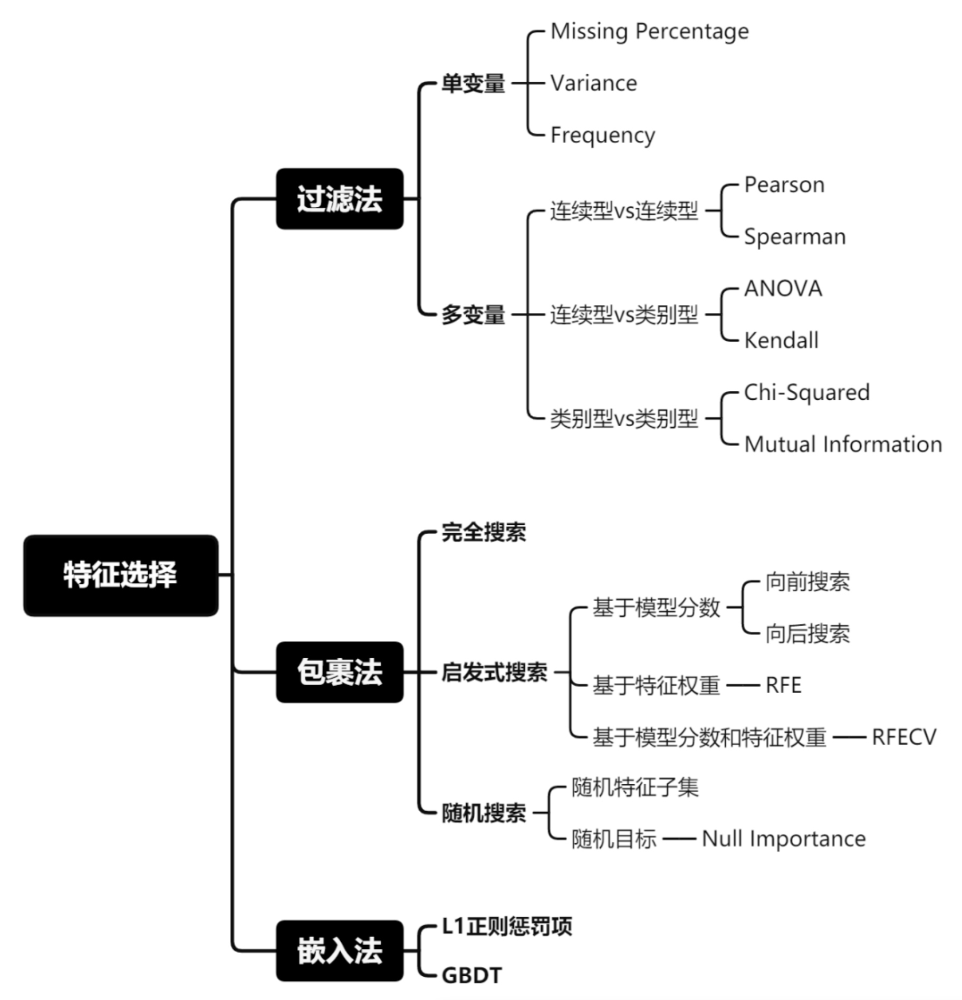

[toc]

# 总览/回顾

这个文件旨在列出一系列的机器学习相关的思路与思考

# 机器学习流派

1. 监督

   1. 分类/回归问题
      1. 逻辑回归
      2. BP神经网络(Back Propagtion Neural Network)

2. 非监督

   1. 数据的内在结构
   2. Apriori算法
   3. k-means算法

3. 强化学习

   1. 环境数据的输入直接反馈到模型的变化

   2. [[蒙特卡洛]]

   3. Q-learning

   4. 时间差学习

# 理论基础
1. 符号学派 ->谓词逻辑
2. 贝叶斯 -> Markov Chain, Bayes
3. 联结学派 -> 大脑 仿生学 
	1. 基于
		1. 生物神经网络的神经元理论
		2. 视觉皮层分层理论->生物视觉皮层分层模型->基于卷积/分层的分类发展
		3. 稀疏理论->抛弃大多数输入信息，仅保留最显著的细节，却颇有成效
			1. **扩展思考A**: LeNet神经网络，底层模型表现出来的图像信号的稀疏性。 
			2. **扩展思考B**: H264编码中，底层模型表现出来的图像信号的稀疏性。

# 数学基础
1. 概率论
	1. 链式法则
		1. $P(a,b,c) = P(a|b,c)*P(b,c)$
		2. $P(b,c)   = P(b|c)*P(c)$
		3. $P(a,b,c) = P(a|b,c)*P(b*c)*P(c)$
	2. 期望
		1. $$E[f(x)]=\sum P(x)f(x)=\int P(x)f(x) $$
		2. 遵从线性性质$$E(ax+by+c)=aE(x)+bE(y)+c$$
	3. 方差
	4. 常见分布:
		1. Bernoulli
		2. 高斯
		3. 指数
	5. Bayes
		1. 关键词
			1. $P(A)$是先验概率(prior)，指的是样本中各种情况出现的概率 
			2. $P(B|A)$是似然(likelihood)，表示A发生的条件下，B出现的概率
			3. $P(A|B)$是后验概率(posterior)
		2. $P(A\cap B)=P(A)*P(B|A)=P(B)*P(A|B)$
		3. [学习材料](https://zhang-each.github.io/My-CS-Notebook/ML/%E7%BB%9F%E8%AE%A1%E6%9C%BA%E5%99%A8%E5%AD%A6%E4%B9%A002%EF%BC%9A%E8%B4%9D%E5%8F%B6%E6%96%AF%E5%AE%9A%E7%90%86/#%E6%9C%B4%E7%B4%A0%E8%B4%9D%E5%8F%B6%E6%96%AF-naive-bayes)
2. 信息熵 = E(信息量) =信息量的**期望**
	1. [教程](https://www.bilibili.com/video/BV1oX4y1w7aG/?spm_id_from=333.337.search-card.all.click)
	2. 等可能事件中, 信息量$H=log_2(N)$, 
		1. N为等可能事件的数量, 
		2. 信息量代表为了区分这些事件, 需要分配不同的符号来进行表示. 
			1. e.g. N=8, 则在电脑中, 需要3 bit来区分, {000, 001, 010, 011,100,101,110,111}
			2. 这里3即为所需的信息量
	3. 非等可能事件怎么办? 将概率 转化为 等可能时间系统中发生某个事件的概率
		1. e.g. 中大乐透概率为1/2000万, 将问题转化为在2000万个球中摸出中奖球的概率
		2. e.g. 一共两个费等概率事件A, B, P(A)=0.2, P(B)=0.8
			1. 转化为log(1/0.2) 与 log(1/0.8), 又因为发生的概率是0.2, 0.8
			2. 所以对应信息量是$P(A)log(\dfrac{1}{P(A)})+P(B)log(\dfrac{1}{P(B)})$
		3. 对于完整的一个概率分布, 则$$
		   \begin{align}
		   \sum_{i=1}^NP_i log(\dfrac{1}{P_i})&=\sum_{i=1}^NP_i(log1-log(\dfrac{1}{P_i}))\\&=\sum_{i=1}^NP_i (0-log(\dfrac{1}{P_i}))\\&=-\sum_{i=1}^NP_i log(P_i)
		   \end{align}
		   $$
3. 矩阵论

# 特征工程与模型选择

1. 特征工程与模型选择

   1. 数据预处理
     1. 数据预处理可能占整个机器学习项目的80%，其是一个繁杂的系统工程，数据预处理的工作质量对整个机器学习项目的质量有重大影响。

     1. 特征选择
       1. 

   3. 实施机器学习算法
      1. 选择模型
         1. 回归
         2. 分类
         3. 聚类
      2. 优化模型
         1. 模型诊断中至关重要的是判断过拟合、欠拟合，常见的方法是绘制学习曲线，交叉验证。通过增加训练的数据量、降低模型复杂度来降低过拟合的风险，提高特征的数量和质量、增加模型复杂来防止欠拟合。诊断后的模型需要进行进一步调优，调优后的新模型需要重新诊断，这是一个反复迭代不断逼近的过程，需要不断的尝试，进而达到最优的状态。
      3. 度量模型性能
         1. 过测试数据，验证模型的有效性，观察误差样本，分析误差产生的原因，往往能使得我们找到提升算法性能的突破点。误差分析主要是分析出误差来源与数据、特征、算法。必要时使用融合方法提升模型性能。

   4. 发布解决方案
      1. 工程上是结果导向，模型在线上运行的效果直接决定模型的成败。 不单纯包括其准确程度、误差等情况，还包括其运行的速度(时间复杂度)、资源消耗程度（空间复杂度）、稳定性是否可接受。

2. 经验误差与过拟合

3. 性能度量

4. 偏差与方差

# 回归算法

# 分类算法

1. k-nn算法

   1. 监督学习
   2. 算法:
      1. 计算所有点位与x的距离, 排序, 距离最近的k的数据, 它们中占比最大的标签即为预测值
   3. 为了确定最佳k值
      1. 需要与k-fold算法配合
      2. k-fold:
         1. 将数据集均分为k份, 进行k次遍历, 每次将第i份定为验证集
         2. 这样所有数据都有机会参与训练

2. naive bayesian

   1. 数学原理

      1. $$
         公理: P(A|B)\cdot P(B)=P(A\cap B)\\
         \begin{align}
         P(A|B,C, \cdots, N)&=P(A|B\cap C\cap \cdots \cap N)\\
         &=\dfrac{P(A\cap \{B\cap C\cap \cdots \cap N\})}{P(B\cap C\cap \cdots \cap N)}\\\\
         &假设B, C, \cdots, N 相互独立\\
         即P(A\cap \{B\cap C\cap \cdots \cap N\})&=P(B,C,\cdots, N|A)P(A)\\&=P(B|A)P(C|A)\cdots P(N|A)P(A)\\
         
         \therefore 公式(2) &=\dfrac{P(B|A)P(C|A)\cdots P(N|A)P(A)}{P(B\cap C\cap \cdots \cap N)}\\\\
         &因为分母均一致\\\\
         P(A|B,C, \cdots, N)&\propto = P(B|A)P(C|A)\cdots P(N|A)P(A)\\
         &这里B, C, \cdots, N 代表特征, A代表class
         \end{align}
         $$

   2. > Input: 训练数据集 D, 测试样本 x
      > Output: 预测类别 y
      >
      > 1. 计算每个类别 Ck 的先验概率 P(Ck)：
      >       P(Ck) = 样本属于类别 Ck 的数量 / 总样本数量
      >
      > 2. 对于每个类别 Ck：
      >       初始化类的概率 P(Ck | x) = P(Ck)
      >
      >       对于测试样本 x 中的每个特征 xi:
      >             计算条件概率 P(xi | Ck)：
      >             - 对于连续特征：通常使用高斯分布估计
      >             - 对于离散特征：使用样本频率估计
      >             累乘每个特征的条件概率，更新类的概率 P(Ck | x) *= P(xi | Ck)
      >
      > 3. 选择具有最大概率的类别作为预测结果：
      >       y = argmax_{Ck} P(Ck | x)
      >
      > 4. 返回 y
      >

   3. 集成学习

   4. 支持向量机

      1. 求几何间隔最大的分离超平面为划分类别的依据。超平面的间隔越大，分类的确信度(confidence)也越大

   5. 

# 聚类算法

1. k-means
   1. 核心: 不断地更新 质心 的位置
      1. 输入参数k, 最大迭代次数N
      2. 随机选择k各参数作为质心
      3. 对全部数据遍历, 对于每条数据, 计算其与所有质心的距离, 将其划分为最近质心的类别
      4. 遍历完一遍全部数据后, 更新计算质心的位置
      5. 持续N次迭代
   2. e.g. 如果数据集有 1000 个样本，选择 k=5k = 5k=5：
      1. 将数据分为 5 份，每份包含 200 个样本。
      2. 每次选取 1 份（200 个样本）作为验证集，其余 4 份（800 个样本）作为训练集，重复 5 次。
      3. 最终结果是这 5 轮验证的性能平均值。
2. 

