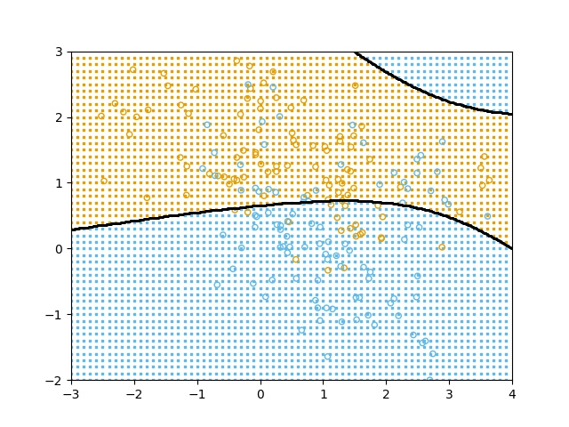
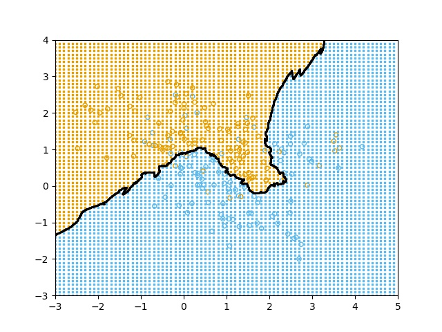
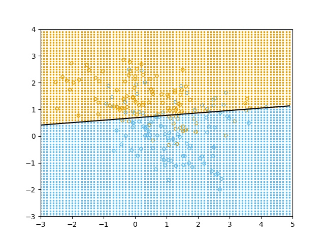

| Classifier       | MAP                           | 1-nn                                                         | 15-nn                                                        | linear                                                       |
| ---------------- | ----------------------------- | ------------------------------------------------------------ | ------------------------------------------------------------ | ------------------------------------------------------------ |
| Graph            |  |  |  |  |
| Correctness Rate | 71.5%                         | 100%                                                         | 84.5%                                                        | 73%                                                          |


| Graph              |  |  |  |
| ------------------ | ------------------------------------------------------------ | ------------------------------------------------------------ | ------------------------------------------------------------ |
| Correctness Rate   | 94.7%                                                        | 94.7%                                                        | 95.7%                                                        |
| Confusion Matrix   | [20.  0.  0.  0.]<br/> [ 0. 28.  0.  0.]<br/> [ 0.  0. 27.  0.]<br/> [ 3.  1.  1. 14.] | [20.  0.  0.  0.]<br/> [ 0. 28.  0.  0.]<br/> [ 0.  0. 27.  0.]<br/> [ 3.  1.  1. 14.] | [19.  0.  0.  1.]<br/> [ 0. 28.  0.  0.]<br/> [ 0.  0. 27.  0.]<br/> [ 1.  1.  1. 16.] |
| Cost Function      | [-0.2, 0.07, 0.07, 0.07]                          [0.07, -0.15, 0.07, 0.07]                      [0.07, 0.07, -0.05, 0.07]                         [0.03, 0.03, 0.03, 0.03] | [-0.2, 0.07, 0.07, 0.07]                          [0.07, -0.15, 0.07, 0.07]                      [0.07, 0.07, -0.05, 0.07]                         [0.03, 0.03, 0.03, 0.03] | [0, 1, 1, 1],<br/>[1, 0, 1, 1],<br/>[1, 1, 0, 1],<br/>[1, 1, 1, 0] |
| Prior Distribution | [0.21, 0.3,0.29,0.2]                                         | [0.21, 0.3, 0.29, 0.5]                                       | [ 0.21, 0.3, 0.29, 0.2]                                      |

# MAP Classifier

```python
"""
file:
description:
author: yq8821@glados.cs.rit.edu 
"""
from tabulate import tabulate
import numpy as np
import matplotlib.pyplot as plt
import pandas as pd


def multi_gaussian_distri(x, mu, covari):
    before_exp = 1 / (np.sqrt(np.power((2 * np.pi), 2) * np.linalg.det(covari)))
    exps = np.exp(
        -0.5 * (np.transpose(x - mu)) * (np.linalg.inv(covari)) * (x - mu))
    return before_exp * exps


def main():
    # path=input("please input the file path:")
    path = "data.npy"
    datas = np.load(path)
    training_data = datas[:, 0:2]
    test_data = datas[:, 0:2]
    training_label = datas[:, 2]
    map_classifier = MAP_classifier()
    map_classifier.fit(training_data, training_label)

    result = map_classifier.predict(test_data)

    map_classifier.draw_train()
    confusion_m(training_label, result)
    # confusion_m(training_label, result)


def get_mean(datas):
    """
    used to compute the mean vector of the data set, while we regard the
    column as the same attribute
    :param datas:
    :return: the meann vertoc of the given datas
    """
    rows = len(datas)
    results = []
    for column in range(len(datas[0])):
        current_value = 0
        for row in range(rows):
            current_value += datas[row, column]
        results.append(current_value / rows)
    return np.array(results)


def get_vari(list_A, list_B, mean):
    """
    compute the covariance between list_A and list_B with the given mean
    vector which is from list_A or list_B
    :param list_A:
    :param list_B:
    :param mean: the mean vector from list A or list B
    :return: the covariance of list A and list B regarding the mean vector
    """
    sums = 0
    for x, y in zip(list_A, list_B):
        sums += ((x - mean) * (y - mean))
    return sums / (len(list_A) - 1)


def get_covar_matrix(datas):
    """
    provide the covariance matrix with the given data. (Mention: one column
    represent one attribute)
    :param datas:
    :return: the vocariance matrix of the given data
    """
    columns = len(datas[0])
    mean_vector = get_mean(datas)
    covari_matrix = np.ones([columns, columns])
    for row in range(columns):
        for col in range(columns):
            # value = get_vari(datas[:, row], datas[:, column], mean_vector[row])
            covari_matrix[row, col] = get_vari(datas[:, row], datas[:, col],
                                               mean_vector[row])
    return covari_matrix


class MAP_classifier():
    """
    the MAP classifier
    """
    # we choose the uniform_distribution as the priori probability distribution
    mus = np.array([])
    covari_matrix = np.array([])
    cluster_label = np.array([])
    cluster_training = np.array([])
    attri_num = 0
    predicted = np.array([])
    training_data_draw = np.array([])
    label_matrix = np.array([])
    plot_range = np.array([])
    ks = np.array([])
    bias = np.array([])
    cluster_probability = np.array([])

    def fit(self, training_data, training_label):
        """
        use the train the model to get the \mu and variance
        :param training_data:
        :param training_label:
        :return: initial the model to get $\mu$ and cluster
        """
        self.plot_range = np.array([round(training_data[:, 0].min()),
                                    round(training_data[:, 0].max()),
                                    round(training_data[:, 1].min()),
                                    round(training_data[:, 1].max())])
        self.attri_num = len(training_data[0])

        self.cluster_label = np.array(
            pd.Series(training_label).value_counts().keys())
        self.cluster_training = [training_data[training_label == label] for
                                 label in self.cluster_label]
        self.cluster_probability = np.array(
            [len(i) / len(training_data) for i in
             self.cluster_training])
        self.mus = np.array([np.array([get_mean(each_training)]).T for
                             each_training in
                             self.cluster_training])
        self.covari_matrix = np.array(
            [get_covar_matrix(each_training) for each_training in
             self.cluster_training])
        self.ks = np.array(
            [mu / np.diagonal(covari_matrix) for mu, covari_matrix in
             zip(self.mus, self.covari_matrix)])

        self.bias = np.array([np.dot(np.transpose(mu), mu) / (-2 * np.diagonal(
            covari_matrix)) + np.log(prb) for mu, covari_matrix, prb in
                              zip(self.mus, self.covari_matrix,
                                  self.cluster_probability)])

    def predict(self, test_data):
        '''
        :param test_data: use the given test data to predict label
        :return: the target predicted label
        '''
        predict_label = []
        for one_data in test_data:
            x = np.array([one_data]).T
            each_p = np.array(
                [-0.5 * np.dot(np.dot((x - mu).T, np.linalg.inv(covar)),
                               x - mu) - 0.5 * np.log(
                    np.linalg.det(covar)) + np.log(prb) for mu, covar, prb in
                 zip(self.mus, self.covari_matrix,
                     self.cluster_probability)])

            s = each_p.reshape(2)
            predict_label.append(self.cluster_label[s == np.max(s)])
            # print(predict_label)
        predict_label = np.array(predict_label).reshape(len(predict_label))
        self.predicted = predict_label
        return predict_label

    def draw_border(self):
        """
        Used to draw black line one the border of different clusters
        :return:
        """
        xs = np.arange(self.plot_range[0], self.plot_range[1], 0.01)
        ys = np.arange(self.plot_range[2], self.plot_range[3], 0.01)
        points_matrix = np.array([[x, y] for x in xs for y in ys])
        label_matrix = np.reshape(self.predict(points_matrix),
                                  (len(xs), len(ys)))
        # print(find_line(label_matrix))
        for item in np.array(find_line(label_matrix,[0,1])):
            plt.scatter(xs[item[:, 0]], ys[item[:, 1]], color="black", s=1)

    def draw_train(self):
        """
        Used to draw background points which reflect the predicted label with given test data
        :return:
        """
        nums = np.array([[x, y] for x in np.arange(self.plot_range[0],
                                                   self.plot_range[1], 0.1)
                         for y in np.arange(self.plot_range[2],
                                            self.plot_range[3], 0.1)])
        self.training_data_draw = self.predict(nums)

        plt.figure()
        plt.xlim(self.plot_range[:2])
        plt.ylim(self.plot_range[2:])
        xxs = nums[self.predicted == 0]
        yys = nums[self.predicted == 1]
        plt.scatter(xxs[:, 0], xxs[:, 1], color="#60B9EA",
                    marker="s", linewidths=1, s=1)
        plt.scatter(yys[:, 0], yys[:, 1], color="#E69F00",
                    marker="s", linewidths=1, s=1)
        self.draw_train_points()
        self.draw_border()
        plt.savefig("a2map.jpg")
        plt.show()


    def draw_train_points(self):
        """
        Draw the training data points on figure
        :return:
        """
        plt.scatter(self.cluster_training[0][:, 0],
                    self.cluster_training[0][:, 1],
                    facecolors='none', color="#E69F00",
                    marker="o", s=20)
        plt.scatter(self.cluster_training[1][:, 0],
                    self.cluster_training[1][:, 1],
                    facecolors='none', color="#60B9EA",
                    marker="o", s=20)


    def gaussian_distri(self, x, mu, vari):
        """
        As we assume the attributes is of gaussian probability distribution,
        we need to achieve this gaussian distribution
        :param x:
        :param mu: the mean vector/mean value
        :param vari: the covariance matrix/variance
        :return: the predicted probability regarding x
        """
        # print("G")
        before_exp = 1 / (np.sqrt(2 * np.pi * vari))
        # print(before_exp)
        exps = np.exp(-0.5 * np.power((x - mu), 2) / vari)
        # print(exps)
        return before_exp * exps


def bfs(matrix, r, c, seen: set(),color):
    """
    Graph search algorithm used to find border between given colors
    :param matrix: the graph which is a matrix format
    :param r: the row number of the graph
    :param c: the column of the graph
    :param seen: the seen list
    :param color: find pixel between given color
    :return: the points/pixel which should be colored black to assemble a line
    """
    if (r, c) in seen:
        return [[], seen]
    else:
        seen.add((r, c))
    queue = []
    queue.append((r, c))
    parent = {(r, c): None}
    coors = []

    while len(queue) > 0:
        vertex = queue.pop(0)
        r = vertex[0]
        c = vertex[1]
        nodes = [(r - 1, c), (r + 1, c),
                 (r, c - 1), (r, c + 1)]
        for neighbor in nodes:
            if not_in_matrix(matrix, neighbor[0], neighbor[1]):
                continue
            else:
                if neighbor not in seen:
                    if (matrix[r][c] == color[1] and matrix[neighbor[0]][
                        neighbor[1]] == color[0]):
                        coors.append((neighbor[0], neighbor[1]))
                    elif (matrix[r][c] ==color[0]  and matrix[neighbor[0]][
                        neighbor[1]] == color[1]):
                        coors.append((r, c))
                    else:
                        queue.append(neighbor)
                        seen.add(neighbor)
                    parent[neighbor] = vertex
    return [coors, seen]


def not_in_matrix(matrix, r, c):
    """
    Used to find if the row, column is out of the matrix/graph
    :param matrix: the graph which is a matrix format
    :param r: the row number
    :param c: the column number
    :return:
    """
    return not (0 <= r < len(matrix) and 0 <= c < len(matrix[0]))


def find_line(matrix,color):
    """
    used to find the border between given colors in matrix
    :param matrix: the graph which is a matrix format
    :param color: the given colors
    :return:
    """
    coors = []
    seen = set()
    for row in range(len(matrix)):
        for column in range(len(matrix[0])):
            result = bfs(matrix, row, column, seen,color)
            coors.append(result[0])
            seen = result[1]
    effect_line = np.array([list(item) for item in coors if len(set(item)) > 2])
    list_of_list = []
    for a_list in effect_line:
        list_of_list.append(np.array([list(item) for item in a_list]))
    list_of_list = np.array(list_of_list)
    return list_of_list


def confusion_m(known_label, predicted_label):
    """
    an old confusion matrix which would be update in next a2cost.py
    :param known_label: the true data
    :param predicted_label:  the predicted data
    :return: the confusion matrix
    """
    matrix = np.empty([3, 3], dtype="str")
    k_orange_index = np.where(known_label == 1)
    k_blue_index = np.where(known_label == 0)
    p_orange_index = np.where(predicted_label == 1)
    p_blue_index = np.where(predicted_label == 0)
    b_but_o = len(np.intersect1d(p_orange_index, k_blue_index))
    b_true_b = len(np.intersect1d(p_blue_index, k_blue_index))
    o_true_o = len(np.intersect1d(p_orange_index, k_orange_index))
    o_but_b = len(np.intersect1d(p_blue_index, k_orange_index))
    print(tabulate([["Blue(0)", b_true_b, o_but_b], ["Orange(1)", b_but_o,
                                                     o_true_o]], \
                   headers=["Predictions", "Blue(0)", "Orange(1)"]))
    print("the correctness is %f" % ((b_true_b + o_true_o) / (
            b_true_b + o_but_b + b_but_o + o_true_o)))


def test():
    """
    a test which is used to test something that im not sure or familiar with.
    :return:
    """
    a = np.array([[1, 10], [1, 10]])
    path = "data.npy"
    datas = np.load(path)
    training_data = datas[:, 0:2]
    # print(np.mean(a, axis=0))
    # print(get_vari(training_data[:,0],training_data[:,0],get_mean(training_data)[0]))
    print(get_covar_matrix(training_data))
    # pass


if __name__ == '__main__':
    main()
    # test()

```

# Bayesian classifier

```python
"""
file:
description: 
author: yq8821@glados.cs.rit.edu 
author_or: 
"""
import numpy as np
import matplotlib.pyplot as plt
import pandas as pd
from tabulate import tabulate

import a2map
import math


def main():
    path = "nuts_bolts.csv"
    datas = np.genfromtxt(path, delimiter=',')
    # print(data)
    training_data = datas[:, 0:2]
    test_data = datas[:, 0:2]
    training_label = datas[:, 2]
    print((training_label == 1).sum() / len(training_label))
    print((training_label == 2).sum() / len(training_label))
    print((training_label == 3).sum() / len(training_label))
    print((training_label == 4).sum() / len(training_label))

    print((training_label == 1).sum())
    print((training_label == 2).sum())
    print((training_label == 3).sum())
    print((training_label == 4).sum())


    print("For q2 a:")
    cost_function = np.array([[-0.2, 0.07, 0.07, 0.07],
                              [0.07, -0.15, 0.07, 0.07],
                              [0.07, 0.07, -0.05, 0.07],
                              [0.03, 0.03, 0.03, 0.03]])

    zero_one_cost_function = np.array([[0, 1, 1, 1],
                                       [1, 0, 1, 1],
                                       [1, 1, 0, 1],
                                       [1, 1, 1, 0]])
    q2a = Bayesian_classifier()
    q2a.fit(training_data, training_label, cost_function,np.array([0.21, 0.3,
                                                                 0.29, 0.2]))
    get_confusion_matrix(training_label,test_data,q2a)
    q2a.draw_background("q2a.jpg")

    print("For q2 b:")
    q2b= Bayesian_classifier()
    q2b.fit(training_data, training_label, cost_function,
                         np.array([0.21, 0.3, 0.29, 0.5]))
    get_confusion_matrix(training_label, test_data, q2b)
    q2b.draw_background("q2b.jpg")

    print("For q2 c:")
    q2c = Bayesian_classifier()
    q2c.fit(training_data, training_label, zero_one_cost_function, np.array([
        0.21, 0.3, 0.29, 0.2]))
    get_confusion_matrix(training_label, test_data, q2c)
    q2c.draw_background("q2c.jpg")

    print("q2_bonous")
    q2addi()

    q3()

def get_confusion_matrix(training_label,test_data,model):
    """
    print the confusion matrix and get correctness rate
    :param training_label: the true value list
    :param test_data: the test data which would be used to get predicted value
    :param model: tell us which model would you like to used to get predicted value
    :return: the target confusion matrix
    """
    print("the confusion matrix is :")
    confu = confusion_matrix(training_label, model.predict(test_data),
                             model.cluster_label)
    print(confu)
    print("the correctness rate is:")
    print(np.diagonal(confu).sum() / confu.sum())


class Bayesian_classifier():
    """
    the structure of this Bayesian_classifier is inspired by the
    scikit-learn library. Therefore I use fit() as the initial/training
    function, and use predict() as prediction function
    """
    mus = np.array([])
    covari_matrix = np.array([])
    cluster_label = np.array([])
    cluster_training = np.array([])
    attri_num = 0
    predicted = np.array([])
    training_data_draw = np.array([])
    label_matrix = np.array([])
    plot_range = np.array([])
    ks = np.array([])
    bias = np.array([])
    cluster_probability = np.array([])
    cost_function = np.array([])

    def fit(self, training_data, training_label, cost_function, prior_matrix,
            rejection=False):
        """
        the training/initial part of this class
        w_{bayes}=\sum c(wi|wj)p(x|wj)p(wj)
        :param training_data:
        :param training_label:
        :param cost_function: provide data for c(wi|wj)
        :param prior_matrix: provide data for p(wj)
        :return:
        """
        self.cost_function = cost_function
        self.plot_range = np.array([round(training_data[:, 0].min()),
                                    round(training_data[:, 0].max()),
                                    round(training_data[:, 1].min()),
                                    round(training_data[:, 1].max())])

        self.attri_num = len(training_data[0])
        self.cluster_label = np.array(list(set(training_label)))

        # self.cluster_label = np.array([1,2,3,4])
        self.cluster_training = [training_data[training_label == label] for
                                 label in self.cluster_label]
        if rejection==True:
            self.cluster_label=np.append(self.cluster_label,5)
        self.cluster_probability = prior_matrix
        self.mus = np.array([np.array([a2map.get_mean(each_training)]).T for
                             each_training in
                             self.cluster_training])
        self.covari_matrix = np.array(
            [a2map.get_covar_matrix(each_training) for each_training in
             self.cluster_training])

    """
    these comments are what I have failed part. I wrote 3 kinds of predict function,
    and two of them failed.
    """


    # def predict(self, test_data):
    #     predict_label = []
    #     for one_data in test_data:
    #         x = np.array([one_data]).T
    #         # print(x)
    #         current_list = []
    #         each_p = np.array([-0.5 * np.dot(np.dot((x - mu).T,
    #                                                 np.linalg.inv(cover_m)),
    #                                          x - mu) - 0.5 * np.log(
    #             np.linalg.det(cover_m)) + np.log(prb)
    #                            for omega_k, cover_m, prb, mu in
    #                            zip(range(len(self.mus)), self.covari_matrix,
    #                                self.cluster_probability, self.mus)])
    #         each_p = each_p.reshape(len(each_p))
    #         each_p = normalize_01(each_p)
    #         each_p = np.array([each_p]).T
    #         current_list = np.dot(self.cost_function, each_p).T
    #         current_list = current_list.reshape(len(current_list[0]))
    #         # print(current_list)
    #         predict_label.append(
    #             self.cluster_label[current_list == np.min(current_list)])
    #     predict_label = np.array(predict_label).reshape(len(predict_label))
    #     self.predicted = predict_label
    #     return predict_label
    #
    # def predict_2(self, test_data):
    #     predict_label = []
    #     for one_data in test_data:
    #         x = np.array([one_data]).T
    #         # print(x)
    #         each_p = np.array([(1 / (
    #             np.sqrt(
    #                 np.power(2 * np.pi, 4) * np.linalg.det(
    #                     self.covari_matrix[omega_k])))) *
    #                            np.exp(-0.5 * np.dot(np.dot(np.transpose(
    #                                x - self.mus[omega_k]), np.linalg.inv(
    #                                self.covari_matrix[omega_k])),
    #                                (x - self.cluster_label[omega_k])),
    #                                   dtype=np.float128) *
    #                            self.cluster_probability[omega_k] for
    #                            omega_k in range(4)])
    #         each_p = each_p.reshape(len(self.cluster_label)).T
    #         # each_p = normalize_01(each_p)
    #         # print(each_p)
    #         each_p = np.array([each_p]).T
    #         current_list = np.dot(self.cost_function, each_p)
    #         current_list = np.array(current_list).reshape(len(current_list))
    #         predict_label.append(self.cluster_label[current_list == np.min(
    #             current_list)])
    #     predict_label = np.array(predict_label).reshape(len(predict_label))
    #     self.predicted = predict_label
    #     return predict_label

    def predict(self, test_data):
        """
        used current data to predict labe lfor test_data
        :param test_data:
        :return: the predicted label
        """
        predicted = []
        for one_data in test_data:
            x = np.array([one_data]).T
            one_result = np.array(
                [1 / (math.sqrt(np.power(2*np.pi,self.attri_num)*np.linalg.det(
                    covar)))*math.exp(-0.5*np.dot(
                    np.dot(np.transpose(x - mean_vector), np.linalg.inv(covar)),
                    x-mean_vector)) * prb for
                 mean_vector, covar, prb in zip(self.mus, self.covari_matrix,
                                                self.cluster_probability)])
            # print(len(self.cluster_training))
            one_result = one_result[0:len(self.cluster_training)].reshape(len(self.cluster_training), 1)
            results = np.dot(self.cost_function, one_result).reshape(1,len(self.cost_function))[0]
            predicted.append(self.cluster_label[results == results.min()][0])
        self.predicted = np.array(predicted)
        # print(self,predicted)
        return np.array(predicted)

    def predict_2(self, test_data):
        """
        used current data to predict labe lfor test_data
        :param test_data:
        :return: the predicted label
        """
        # predicted = []
        # for one_data in test_data:
        #     x = np.array([one_data]).T
        #     one_result = np.array(
        #         [1 / (math.sqrt(np.power(2*np.pi,self.attri_num)*np.linalg.det(
        #             covar)))*math.exp(-0.5*np.dot(
        #             np.dot(np.transpose(x - mean_vector), np.linalg.inv(covar)),
        #             x-mean_vector)) * prb for
        #          mean_vector, covar, prb in zip(self.mus, self.covari_matrix,
        #                                         self.cluster_probability)])
        #     # print(len(self.cluster_training))
        #     # one_result = one_result[0:len(self.cluster_training)].reshape(
        #     #     len(self.cluster_training), 1)
        #     # one_result=one_result+1+np.abs(one_result.min())
        #     one_result=one_result/one_result.sum()
        #     one_result=one_result.reshape(1,4)[0]
        #     C=self.cost_function[4,:]
        #     C=C[one_result==one_result.max()]
        #     if C<1-one_result.max():
        #         predicted.append(5)
        #     else:
        #         predicted.append(self.cluster_label[one_result ==
        #                                             one_result.max()])
        #     # results = np.dot(self.cost_function, one_result).reshape(1,len(self.cost_function))[0]
        #     # predicted.append(self.cluster_label[results == results.min()][0])
        # self.predicted = np.array(predicted)
        # # print(self,predicted)
        # return np.array(predicted)

        predicted = []
        for one_data in test_data:
            x = np.array([one_data]).T
            one_result = np.array(
                [1 / (math.sqrt(
                    np.power(2 * np.pi, self.attri_num) * np.linalg.det(
                        covar))) * math.exp(-0.5 * np.dot(
                    np.dot(np.transpose(x - mean_vector), np.linalg.inv(covar)),
                    x - mean_vector)) * prb for
                 mean_vector, covar, prb in zip(self.mus, self.covari_matrix,
                                                self.cluster_probability)])
            # print(len(self.cluster_training))
            one_result = one_result[0:len(self.cluster_training)].reshape(
                len(self.cluster_training), 1)
            results = np.dot(self.cost_function, one_result).reshape(1, len(
                self.cost_function))[0]
            predicted.append(self.cluster_label[results == results.min()][0])
        self.predicted = np.array(predicted)
        # print(self,predicted)
        return np.array(predicted)


    def draw_train(self):
        """
        draw training data's points
        :return:
        """
        plt.scatter(self.cluster_training[0][:, 0],
                    self.cluster_training[0][:, 1],
                    color="blue",
                    marker="+", s=20)
        plt.scatter(self.cluster_training[1][:, 0],
                    self.cluster_training[1][:, 1], facecolors='none',
                    color="orange",
                    marker="o", s=20)
        plt.scatter(self.cluster_training[2][:, 0],
                    self.cluster_training[2][:, 1],
                    color="red",
                    marker="o", s=20)
        plt.scatter(self.cluster_training[3][:, 0],
                    self.cluster_training[3][:, 1],
                    color="green",
                    marker="x", s=20)


    def draw_border(self,if_rejection):
        """
        draw the borders line between different clusters
        :return:
        """

        interval=0.002
        xs = np.arange(self.plot_range[0], self.plot_range[1], interval)
        ys = np.arange(self.plot_range[2], self.plot_range[3], interval)
        points_matrix = np.array([[x, y] for x in xs for y in ys])
        label_matrix = np.reshape(self.predict(points_matrix),
                                  (len(xs), len(ys)))
        # print(label_matrix)
        for item in np.array(a2map.find_line(label_matrix, [1, 4])):
            plt.scatter(xs[item[:, 0]], ys[item[:, 1]], color="black", s=1)
        for item in np.array(a2map.find_line(label_matrix, [3, 4])):
            plt.scatter(xs[item[:, 0]], ys[item[:, 1]], color="black", s=1)
        for item in np.array(a2map.find_line(label_matrix, [2,4])):
            plt.scatter(xs[item[:, 0]], ys[item[:, 1]], color="black", s=1)
        for item in np.array(a2map.find_line(label_matrix, [2, 3])):
            plt.scatter(xs[item[:, 0]], ys[item[:, 1]], color="black", s=1)
        if if_rejection:
            for item in np.array(a2map.find_line(label_matrix, [5, 2])):
                plt.scatter(xs[item[:, 0]], ys[item[:, 1]], color="black", s=1)
            for item in np.array(a2map.find_line(label_matrix, [5, 3])):
                plt.scatter(xs[item[:, 0]], ys[item[:, 1]], color="black", s=1)
            for item in np.array(a2map.find_line(label_matrix, [5, 4])):
                plt.scatter(xs[item[:, 0]], ys[item[:, 1]], color="black", s=1)
    def draw_background(self,pic_name,if_rejection=False):
        """
        draw all the potential information including training data points,
        background points, and the border of different clusters
        :param pic_name: used to assign a name for the saved picture.
        :return: show the plot and save picture
        """
        interval=0.01
        nums = np.array([[x, y] for x in np.arange(self.plot_range[0],
                                                   self.plot_range[1], interval)
                         for y in np.arange(self.plot_range[2],
                                            self.plot_range[3], interval)])
        # print(nums)
        self.training_data_draw = self.predict(nums)
        # print(self.predicted)
        plt.figure(dpi=600)
        plt.xlim(self.plot_range[:2])
        plt.ylim(self.plot_range[2:])
        xxs = nums[self.training_data_draw == 1]
        yys = nums[self.training_data_draw == 2]
        zzs = nums[self.training_data_draw == 3]
        kks = nums[self.training_data_draw == 4]

        self.draw_train()
        plt.scatter(xxs[:, 0], xxs[:, 1], color="blue",
                    marker="s", linewidths=1, s=1)
        plt.scatter(kks[:, 0], kks[:, 1], color="green",
                    marker="s", linewidths=1, s=1)
        plt.scatter(yys[:, 0], yys[:, 1], color="orange",
                    marker="s", linewidths=1, s=1)
        plt.scatter(zzs[:, 0], zzs[:, 1], color="red",
                    marker="s", linewidths=1, s=1)
        self.draw_border(if_rejection)
        plt.savefig(pic_name)
        plt.show()


def normalize_01(a_numpy_array):
    """
    which I tried to normalize the probability of the p(x|wj)p(wj) while lack
    the denominator, final I dont use this
    :param a_numpy_array:
    :return:
    """
    return (a_numpy_array - a_numpy_array.min()) / (
            a_numpy_array.max() - a_numpy_array.min())


def test():
    # a=np.array([-1,2.7,2.1])
    # print(normalize_01(a))
    path = "/Users/qyl/Library/Mobile Documents/com~apple~CloudDocs/PatternRecognition-WorkSpace/Assignment_2/nuts_bolts.csv"
    datas = np.genfromtxt(path, delimiter=',')
    # print(data)
    training_data = datas[:, 0:2]
    test_data = datas[:, 0:2]
    training_label = datas[:, 2]
    cost_function = np.array([[-0.2, 0.07, 0.07, 0.07],
                              [0.07, -0.15, 0.07, 0.07],
                              [0.07, 0.07, -0.05, 0.07],
                              [0.03, 0.03, 0.03, 0.03]])
    q2a = Bayesian_classifier()
    q2a.fit(training_data, training_label, cost_function,
            np.array([0.21, 0.3, 0.29, 0.2]))
    confu=confusion_matrix(training_label,q2a.predict(test_data),
                           q2a.cluster_label)
    print(np.diagonal(confu).sum()/confu.sum())
    q2a.draw_background("test.jpg")

def confusion_matrix(test_label,predicted_label,labels):
    """
    a powerful confusion matrix with 100% creative idea for myself
    :param test_label:
    :param predicted_label:
    :param labels:
    :return:
    """
    confus_m=np.zeros((len(labels),len(labels)))
    for t,p in zip(test_label,predicted_label):
        confus_m[np.where(labels==t),np.where(labels==p)]+=1
    return confus_m

def test2():
    a=np.array([[1,7,9],[4,1,2],[5,6,11],[9,7,2]])
    print(np.cov(a.T))
    print(a2map.get_covar_matrix(a))
def q3():
    cost_function = np.array([[-0.2, 0.07, 0.07, 0.07],
                              [0.07, -0.15, 0.07, 0.07],
                              [0.07, 0.07, -0.05, 0.07],
                              [0.03, 0.03, 0.03, 0.03]])
    cost_function_2=np.hstack((cost_function[:,0:3]*2,np.array([
        cost_function[:,3]]).T))

    cost_function_3 = np.hstack((cost_function[:, 0:3], np.array([
        cost_function[:, 3] * 0.5]).T))


    print(cost_function_3)

    p1=np.array([20,28,27,19])/94
    p1=np.array([p1]).T
    p2=np.array([np.array([20,28,27,38])/113]).T
    # print(p2)
    m2=np.dot(p2,p2.T)

    path = "nuts_bolts.csv"
    datas = np.genfromtxt(path, delimiter=',')

    training_data = datas[:, 0:2]
    test_data = datas[:, 0:2]
    training_label = datas[:, 2]
    answer=np.dot(np.dot(np.dot(cost_function,p1),p2.T),np.linalg.inv(m2))

    # print(answer)

    q3old = Bayesian_classifier()
    q3old.fit(training_data, training_label, cost_function,
           np.array([20, 28, 27, 19]) / 94)
    get_confusion_matrix(training_label, test_data, q3old)
    q3old.draw_background("q3_old_cost.jpg")
    print("new cost edition 1:")
    print(cost_function_2)
    # np.array([[-0.2500, -0.0625, 0, 0]
    #           [-0.1250, 0.0156, 0.0313, 0.0313]
    #           [0, 0.1250, 0, 0.2500]
    #           [0.5000, -0.2500, 0.1250, 0]])

    q3new = Bayesian_classifier()
    q3new.fit(training_data, training_label, cost_function_2, np.array([20,28,27,
                                                               38])/113)
    get_confusion_matrix(training_label, test_data, q3new)
    q3new.draw_background("q3_new_cost_edition_1.jpg")

    q3new2 = Bayesian_classifier()
    q3new2.fit(training_data, training_label, cost_function_3,
              np.array([20, 28, 27,
                        38]) / 113)
    get_confusion_matrix(training_label, test_data, q3new2)
    q3new2.draw_background("q3_new_cost_edition_2.jpg")
    print("new cost edition 2:")
    print(cost_function_3)

def q2addi():
    cost_function = np.array([[-0.2, 0.07, 0.07, 0.07],
                              [0.07, -0.15, 0.07, 0.07],
                              [0.07, 0.07, -0.05, 0.07],
                              [0.03, 0.03, 0.03, 0.03],
                              [-0.16,-0.11,0.01,0.07]])
    path = "nuts_bolts.csv"
    datas = np.genfromtxt(path, delimiter=',')

    training_data = datas[:, 0:2]
    test_data = datas[:, 0:2]
    training_label = datas[:, 2]


    a2addition = Bayesian_classifier()
    a2addition.fit(training_data, training_label, cost_function,
              np.array([20, 28, 27, 19]) / 94,True)
    # get_confusion_matrix(training_label, test_data, a2addition)

    print("the confusion matrix is :")
    confu = confusion_matrix(training_label, a2addition.predict_2(test_data),
                             a2addition.cluster_label)
    print(confu)
    print("the correctness rate is:")
    print(np.diagonal(confu).sum() / confu.sum())

    a2addition.draw_background("q2_bonous.jpg",True)


if __name__ == '__main__':
    main()
    # q3()
    # q2addi()
    # test()
    # test2()

```

